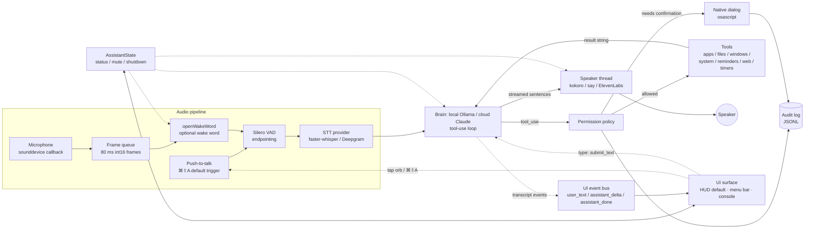

# Ada — Engineering Design

*Status: v0.1 (MVP). Technology choices reflect the landscape as of mid-2026 and are recommendations, not permanent commitments.*

## 1. Summary

Ada is a single-user voice assistant that runs as a Python process on a Mac. By default it is triggered by a push-to-talk hotkey (⌘⇧A); an optional local wake word ("hey mycroft" out of the box, or a custom-trained phrase) enables hands-free activation. Once triggered it records one spoken request (ended by silence), transcribes it (locally by default), and sends the text to the LLM brain with a set of typed tool definitions. The brain is pluggable (`llm.provider`): by default a **local model served by Ollama** (e.g. `gemma4:12b`) — free and fully on-device — or, opt-in, **cloud Claude** (Anthropic Messages API). The brain either answers directly or calls tools — open an app, search files, move a window, set a reminder, query the web — in a bounded loop. Every tool call passes through a permission policy; risky calls raise a native macOS confirmation dialog and everything is recorded in a JSONL audit log. Replies are spoken sentence-by-sentence as they stream from the model, so the assistant starts talking before it has finished thinking. The default UI is a native on-screen **HUD** — a floating, frameless, translucent glass panel (rendered by pywebview/WKWebView) whose animated orb, status pill, and live transcript reflect the current state (idle / listening / thinking / speaking / muted) and which lets the user talk (tap the orb / ⌘⇧A), **type** to Ada, mute, and quit; a menu-bar icon and a plain terminal are alternative surfaces. Typed input enters through `Assistant.submit_text()` and shares the same `_answer()` turn logic — brain, tools, safety, speaker, and barge-in — as a voice turn. UI surfaces stay decoupled from the pipeline: transcript events flow over a small thread-safe **UI event bus** and status changes over `AssistantState` listeners. The design principle throughout: **local by default, cloud by explicit opt-in, and the user can always see and stop what it is doing.**

## 2. Technology choices

> Recommendations as of **mid-2026**. Each row lists the shipped choice and the main alternatives that were considered and why they lost (for now).

| Category | Chosen | Local/Cloud | License | Why | Alternatives considered |
|---|---|---|---|---|---|
| Wake word (optional; hotkey is the default trigger) | **openWakeWord** (`hey_mycroft_v0.1`, ONNX) | Local | Apache-2.0 | Free pretrained phrases (`hey_mycroft` / `alexa` / `hey_rhasspy` / `hey_jarvis`), no account/keys, runs comfortably on Apple Silicon CPU via onnxruntime, ~80 ms frames. There is **no prebuilt "hey ada"** — a name-matching phrase requires a custom-trained model (roadmap). Used only when hands-free wake is enabled. | **Picovoice Porcupine** — best-in-class accuracy but requires an access key and commercial licensing; custom-keyword training services; simple energy triggers (far too many false wakes). |
| VAD | **Silero VAD** (via `pysilero_vad`) | Local | MIT | Small neural model, robust to background noise, clean speech-probability API, same 16 kHz frames as the rest of the pipeline. | **webrtcvad** — fast but energy-based and noticeably more false positives in noisy rooms; aging wheels. Raw RMS thresholds — brittle. |
| STT | **faster-whisper** (CTranslate2, `small.en`, int8); **Deepgram nova-3 REST** optional | Local (default) / Cloud (opt-in) | MIT / commercial API | Best accuracy-per-second on M-series CPU with int8; fully offline; Deepgram opt-in for users who want lower latency and better accuracy and accept sending audio. | **whisper.cpp** — excellent, but Python binding friction; **mlx-whisper** — Apple-GPU fast but younger tooling; Apple **Speech.framework** — needs PyObjC and per-app entitlements; **OpenAI/Deepgram streaming websockets** — deferred to v0.2. |
| TTS (pluggable via `tts.provider`) | **Kokoro** local neural voice (recommended, ONNX via `kokoro-onnx`); **macOS `say`** (zero-dep fallback); **ElevenLabs Flash REST** (cloud, opt-in) | Local (default) / Cloud (opt-in) | Kokoro Apache-2.0 open weights / OS built-in / commercial API | Kokoro is a genuinely natural voice running fully on-device (no key, no cost, ~0.5× realtime on Apple Silicon, per-sentence synth) — the free/local answer to ElevenLabs; `say` is the instant zero-dependency fallback; ElevenLabs Flash is the low-latency cloud option (reply text only). All three share one `arm()`/`stop()` interrupt contract for barge-in, and `create_tts` falls back to `say` (with a warning) when a provider isn't ready. | **Piper** — good local neural TTS, a touch less natural than Kokoro and needs PyPI wheels that are fussier on ARM; **AVSpeechSynthesizer** via PyObjC — more code for little gain over `say`; OpenAI TTS — another key for marginal benefit. |
| LLM / brain (pluggable via `llm.provider`) | **Ollama + a local model** (default, e.g. `gemma4:12b`, native `/api/chat`, streaming + tool calling); **Anthropic Claude** (Messages API) optional cloud path | Local (default) / Cloud (opt-in) | Gemma open weights (Apache-2.0-style) / commercial API | Local is free, private, and fully on-device — no key, no per-token cost; streaming enables speak-while-generating and one model handles routing/conversation/tools. Cloud Claude is the opt-in path when the strongest, most reliable tool use matters. The honest trade: local models vary at tool calling (Gemma chats well but its Ollama tool support is inconsistent), while cloud Claude is strongest at tools. Both backends share one bounded loop and safety layer (`BaseBrain`). | Other local runtimes: **llama.cpp**, **LM Studio**, **vLLM**; for tool-calling reliability **qwen2.5** / **llama3.1** beat Gemma (also fully local & free). Cloud/other: **OpenAI Realtime** (speech-to-speech) — impressive latency but less control over the tool/safety layer and costs; multi-model router — unnecessary complexity for an MVP. |
| Desktop control | **AppleScript / `osascript` + `open` + System Events** | Local | OS built-in | Native, permission-gated by macOS (TCC), semantic ("tell app Reminders…") rather than pixel-based; degrades loudly with clear errors. | **pyautogui** — coordinate clicking is brittle and needs screen recording; **Hammerspoon** — powerful but a separate Lua app to install; **Shortcuts** — good for canned flows, awkward to parameterize; **atomacos/AX API** — deeper but much more code. |
| UI / HUD (default) | **pywebview** (WKWebView + pyobjc) + a self-contained Canvas/HTML front-end | Local | BSD | A real native macOS window (frameless, translucent, always-on-top) with web-quality visuals — the animated orb, glass panel, and live transcript — for far less code than hand-painting a Qt scene; the front-end is one offline `index.html` (inline CSS/Canvas/JS, no external assets). The JS↔Python bridge and DOM updates are verified working end-to-end. | **PySide6/Qt** or **Tkinter** — much more code for the same glow-heavy visuals; native **SwiftUI** — the eventual native app (v1.0 roadmap) but a separate toolchain; **Electron** — a whole Chromium per window, far too heavy. |
| UI / menu bar + terminal (alternatives) | **rumps** menu-bar app (optional extra) + console fallback | Local | BSD | Tiny pure-Python wrapper over PyObjC/NSStatusBar; the lightweight surface when you don't want the HUD (`--menubar`), with a plain terminal (`--no-gui`) as the last fallback — each still shows state and offers mute/quit. | **SwiftBar** plugin — separate install; a fully native **Swift** app or **Electron** — the eventual v1.0 direction, now that the HUD already covers the polished-UI need. |
| Packaging | **pip src-layout**, `ada` console script; `.env` + YAML config | Local | — | One `pip install -e ".[full]"`; optional extras keep the core lean (`gui`, `voice`, `menubar`, `hotkey`, `websearch`). | **py2app / briefcase** `.app` bundle — planned for v1.0; **PyInstaller** — painful with onnxruntime/ctranslate2 binaries. |

> **Why the brain is pluggable (`llm.provider`).** STT and TTS were already provider-swappable; the LLM now follows the same shape, and it is a direct privacy/cost-vs-quality trade. The **local** default (Ollama) is free and never leaves the Mac, but local models vary at tool calling — some Gemma builds don't expose Ollama's `tools` API at all, in which case Ada detects it, says so once ("this local model can chat but can't run Mac actions"), and continues chat-only; `qwen2.5` / `llama3.1` are the most reliable local tool callers. **Cloud Claude** is the opt-in path when reliable desktop-control tool use matters most — it is the strongest at tools. Shared safe-execution logic (permission policy → confirm → timeout → audit, plus the bounded loop) lives in `brain/base.py` (`BaseBrain`); `OllamaBrain` and `AnthropicBrain` subclass it, and a `create_brain(cfg, …)` factory in `brain/__init__.py` selects the backend. To keep the whole pipeline on-device and free, STT also defaults back to local (`stt.provider: local`), with Deepgram as an optional cloud fallback.

## 3. Architecture

### Component graph



### One voice turn (with a confirmation)

```mermaid
sequenceDiagram
    participant U as User
    participant A as Audio worker
    participant S as STT
    participant B as Brain (local/cloud)
    participant P as Policy/Confirm
    participant T as Tool
    participant V as Speaker thread

    U->>A: tap ⌘⇧A (push-to-talk default; or optional wake word)
    A->>A: chime, status=LISTENING, start VAD capture
    U->>A: "quit Music" ... 0.9 s silence
    A->>S: utterance PCM (with 320 ms pre-roll)
    S-->>B: "quit Music" (status=THINKING)
    B->>B: brain streams -> tool_use: quit_app{app_name: "Music"}
    B->>P: evaluate(quit_app, args)
    P->>U: native dialog "Quit Music?" (always_confirm)
    U-->>P: Approve
    P->>P: append audit record (confirmed=true)
    P->>T: run handler
    T-->>B: "Quit Music."
    B->>B: brain streams final text
    B->>V: enqueue sentence 1 (speaking starts immediately)
    V->>U: "Done — Music is closed." (status=SPEAKING)
    V->>A: playback finished, status=IDLE
    Note over U,V: Barge-in: tapping ⌘⇧A (or the wake word, if hands-free) during SPEAKING<br/>sets the cancel Event, Speaker.stop() kills playback, a new turn begins.
```

## 4. Audio and command-processing flow

Step by step, with the latency budget for a typical short command:

1. **Continuous capture.** `sounddevice` delivers 80 ms mono int16 frames (1280 samples @ 16 kHz) from a PortAudio callback into a bounded `queue.Queue`. If muted, frames are discarded here.
2. **Trigger (IDLE).** By default a push-to-talk hotkey (⌘⇧A) starts a turn instantly. With hands-free wake enabled, each frame instead goes through openWakeWord; a score above `wake.threshold` triggers, then a `cooldown_s` guard suppresses double-triggers (**detection lag < 100 ms** after the phrase ends).
3. **Endpointing (LISTENING).** A chime plays; Silero VAD classifies each frame. Capture keeps a **320 ms pre-roll** ring so the first syllable is never clipped, requires `min_speech_ms` (200 ms) of speech to commit, and ends the utterance after **`end_silence_ms` = 900 ms** of trailing silence — or gives up after `no_speech_timeout_s` (6 s) / caps at `max_utterance_s` (15 s).
4. **Transcription (THINKING).** The buffered PCM goes to the STT provider. **Local faster-whisper `small.en` int8: ~0.5–1.5 s** for a short command on M-series; Deepgram REST is typically faster wall-clock but adds network.
5. **Brain.** The transcript is appended to short-term history (last `history_max_messages`, reset after `reset_history_after_min` idle minutes) and sent to the brain — the local Ollama model (default) or cloud Claude — with all registered tool schemas. It streams back either text or `tool_use` blocks. (If the local model lacks tool support, Ada notes it once and continues chat-only.)
6. **Tool loop.** For each `tool_use`: the policy evaluates it (allow / deny / confirm), a confirmation dialog is shown if required, the audit record is appended, the handler runs, and its short result string is returned as a `tool_result`. The loop is bounded by `max_tool_iterations` (6).
7. **Speak while generating.** Streamed text is cut into sentences and enqueued to the Speaker thread; **the first sentence is audible before the full reply has finished generating**. Status goes SPEAKING, then IDLE.
8. **Barge-in.** During SPEAKING (and THINKING), the trigger stays live. Another hotkey tap (or a new wake detection, if hands-free is enabled) sets a cancel `threading.Event`: playback stops mid-word, the pending queue is flushed, in-flight generation is abandoned, and a fresh LISTENING turn starts.

**Budget for "open Safari" (tap ⌘⇧A, local STT): ~2.5–3.5 s from end of speech to start of reply** — 0.9 s endpoint silence + ~1 s STT + ~0.5–1 s first model tokens + first sentence to the speaker. With a local Ollama model the *first* request after a cold start also pays a one-time model-load-into-RAM cost of a few seconds; `keep_alive` keeps the model resident so later turns skip it.

## 5. Threading model

| Thread | Owns | Notes |
|---|---|---|
| **Mic callback** (PortAudio) | Pushes frames into the frame queue | Never blocks; drops frames if the queue is full; no Python work beyond the enqueue. |
| **Audio worker loop** | Wake scan + turn state machine (IDLE → LISTENING → hand-off) | Pulls from the frame queue; runs openWakeWord and Silero; owns pre-roll/endpointing buffers. |
| **Turn thread** (one per turn) | STT + LLM streaming + tool execution | Spawned per utterance so the worker loop keeps scanning for barge-in; checks the cancel Event between steps. |
| **Speaker worker** | TTS queue | Consumes sentence chunks; `speak()` blocks per chunk; `stop()` interrupts playback from any thread. |
| **Main thread** | The UI: the **HUD** (pywebview — `webview.start()`), or the `rumps` menu bar, or a console wait loop — all of which AppKit requires on the main thread | With the HUD (like the menu bar) the assistant voice loop runs on a background **worker thread** while the UI owns the main thread; `webview.start()` blocks until the window closes. UI updates arrive via `AssistantState` listeners plus the UI event bus, marshalled into the webview with `window.evaluate_js`; the front-end calls back through `window.pywebview.api`. |

Coordination is deliberately primitive: **`AssistantState`** (thread-safe status + mute + `shutdown_event`) plus per-turn cancel **`threading.Event`s**. Barge-in = set cancel Event + `Speaker.stop()`. Kill switch = `state.request_shutdown()`, which every loop polls. No asyncio — every latency-critical library here (PortAudio callback, ctranslate2, subprocess `say`) is thread-shaped, not coroutine-shaped. A separate **thread-safe UI event bus** (`ui/events.py`) carries transcript events (`user_text` / `assistant_delta` / `assistant_done`) from the pipeline to whichever UI is subscribed, keeping the loop ignorant of which surface (HUD, menu bar, console) is attached; broken subscribers are logged, never fatal.

## 6. Permissions and safety model

- **Allowlists (config-driven, deny by default at the edges):**
  - `allowed_app_dirs` — apps can only be launched from these folders; `blocked_apps` can never be launched or quit.
  - `file_roots` — file search/open never leaves these directories (paths are resolved, so `../` tricks fail).
  - `url_schemes` — only `http`/`https` open by default (no `file:`, `tel:`, custom schemes).
- **Risk tiers.** Every tool is registered as `safe` or `confirm` (`ToolSpec.risk`). `confirm` tools — and anything listed in `permissions.always_confirm` — show a **native macOS dialog** (via osascript) with a plain-English, per-call summary ("Quit Music?"). Default answer is Cancel; no reply means no.
- **Audit log.** With `logging.audit: true`, every evaluated tool call is appended to `logs/audit.jsonl`: timestamp, tool name, arguments, policy decision, whether the user confirmed, outcome or error. Content is what the model requested — never raw audio.
- **Mute and kill switch.** Mute (menu bar) discards mic frames at the earliest point in the pipeline. Quit / Ctrl+C sets a global shutdown event that stops capture, playback, and the tool loop.
- **Visible state.** The menu-bar icon and chimes make "the mic is live" impossible to miss.

**Deliberately NOT implemented in v0.1** — these are omissions, not oversights:

| Capability | Why not |
|---|---|
| Arbitrary shell execution | Unbounded blast radius; an LLM-composed shell string is exactly the failure mode the tool registry exists to prevent. Every capability is a typed, reviewable tool instead. |
| File deletion / modification | Irreversible. v0.1 tools are read-and-open only; anything destructive would need trash-based undo plus confirmation, which is future work. |
| Raw mouse/keyboard control | Coordinate-based automation is brittle and effectively unlimited-privilege. Semantic AppleScript actions do the same jobs accountably. |
| Screen capture / screen understanding | Highest-sensitivity data on the machine. Deferred to v0.3, and then only on-demand per request, never continuous. |

## 7. Project structure

```
AI assistant/
├── pyproject.toml               # package metadata, extras (menubar/hotkey/websearch/full)
├── config.yaml                  # user config (created by `ada setup`)
├── .env                         # API keys (never committed)
├── logs/                        # ada.log + audit.jsonl
├── docs/DESIGN.md               # this document
├── tests/                       # unit tests (registry, policy, splitter, config)
└── src/ada/
    ├── cli.py                   # `ada` entry point: setup/doctor/run/text/say/listen
    ├── main.py                  # wiring + the main event loop (threads, turn state machine)
    ├── config.py                # layered config: defaults <- config.yaml <- env/.env secrets
    ├── config.default.yaml      # all keys with comments (bundled)
    ├── state.py                 # AssistantState: thread-safe status/mute/shutdown + listeners
    ├── log.py                   # app logging setup (rotating file + stderr)
    ├── audio/                   # capture (sounddevice), wake (openWakeWord), vad (Silero), chimes
    ├── stt/                     # base.py contract; local (faster-whisper), deepgram (REST)
    ├── tts/                     # base.py contract; kokoro (neural), say, elevenlabs; speaker queue + sentence splitter
    ├── brain/                   # pluggable LLM: base.py (BaseBrain), ollama_client.py (local default), client.py (Anthropic), create_brain factory, prompts, streaming tool-use loop
    ├── tools/                   # registry.py + apps, files, windows, system, reminders, web, timers
    ├── safety/                  # base.py contracts; policy engine, osascript confirmer, JSONL audit
    └── ui/                      # UI surfaces + the bus that feeds them
        ├── events.py           # thread-safe UI event bus (transcript pub/sub)
        ├── hud/                 # native HUD (default): app.py (pywebview window + _AdaApi JS bridge), index.html (self-contained Canvas front-end), __init__.py
        ├── menubar.py          # rumps menu-bar icon (optional; --menubar)
        ├── console.py          # plain-terminal status fallback (--no-gui)
        └── hotkey.py           # pynput push-to-talk listener
```

## 8. Main event loop

The real implementation lives in `src/ada/main.py`; simplified to its skeleton:

```
start mic capture -> frame_queue; start speaker thread; warm up STT
while not state.shutting_down:
    frame = frame_queue.get()
    if state.muted: continue
    if status is IDLE and wake_score(frame) > threshold:
        speaker.stop()                      # barge-in if we were speaking
        cancel_event = new Event; play chime; status = LISTENING
        spawn turn_thread(cancel_event)
def turn_thread(cancel):
    audio = record_until_silence(vad)       # pre-roll + endpointing
    text  = stt.transcribe(audio);  status = THINKING
    for event in brain.stream(text, tools): # bounded tool loop inside
        if cancel.is_set(): return
        if event is tool_use:  result = policy_check + confirm? + audit + run
        if event is sentence:  speaker.enqueue(sentence)  # status = SPEAKING
    status = IDLE
```

## 9. Roadmap

- **v0.1 (this MVP).** Everything above: wake word, VAD, local STT, pluggable brain tool loop, local neural (Kokoro) TTS, the on-screen **HUD** (+ menu-bar and terminal surfaces), policy + confirmations + audit, six CLI commands.
- **v0.2.** Streaming STT via Deepgram websockets (transcribe while the user is still talking); a follow-up window after a reply (a few seconds of trigger-free listening for "and also…"); a simple long-term memory file (user-approved facts the brain can read/write); a better local tool-calling model (or a custom local fine-tune) so on-device Mac actions are as reliable as the cloud path; a custom-trained **"hey ada"** openWakeWord model (synthetic-speech data generation + model training, a multi-hour offline step) so the hands-free wake phrase finally matches the name.
- **v0.3.** Screen understanding via on-demand screenshots (explicit per-request, never continuous) with a vision-capable model; browser automation via AppleScript/Playwright; more voices and per-context voice profiles.
- **v1.0.** A fully native Swift app (or a packaged `.app` via briefcase/py2app) so users never see a terminal — the on-screen **HUD already delivers the first-class polished UI** (pywebview/WKWebView), so this is about going fully native + packaged rather than building a UI from scratch; auto-start login item; signed/notarized distribution.

## 10. Testing plan

- **Unit tests** (no hardware, no network): tool registry (registration, schema export, duplicate names); permission policy (allow/deny/confirm matrices, path-escape attempts, blocked apps, URL schemes); sentence splitter (abbreviations, numbers, streaming chunk boundaries); short-term memory trimming/reset; AppleScript argument quoting/escaping (injection attempts).
- **Latency measurement**: `ada doctor` times model load and a canned-audio transcription; log timestamps in a real turn give wake→listen, endpoint→transcript, transcript→first-token, first-token→first-audio.
- **Wake-word bench (idea; applies when hands-free wake is enabled)**: replay a folder of positive clips of the enabled wake phrase (the prebuilt phrase, or a future custom "hey ada" model — varied speakers/distances) and hours of negative audio (podcasts, TV) through the detector offline; report false-accepts/hour and false-reject rate per threshold to tune `wake.threshold`.
- **Manual tool script**: one scripted utterance per tool (open app, blocked app, file inside/outside roots, window move, volume, reminder, note, timer, web query, quit-app confirm-Approve and confirm-Cancel), checking spoken result + audit line each time.
- **Failure recovery**: brain unreachable (local Ollama server down, or no network for cloud → spoken apology, state returns to IDLE); when the brain is local, doctor flags a stopped Ollama server or an unpulled model with an `ollama pull <model>` hint; when `llm.provider: anthropic`, a missing/invalid `ANTHROPIC_API_KEY` gives a clear startup error from doctor/run; local model without tool support (Ada continues chat-only after a one-time notice); mic permission revoked mid-run (capture error → ERROR status, no crash); Deepgram selected without a key (clean fallback message); model files deleted (setup re-downloads).

## 11. Key risks and honest limitations

- **Wake accuracy in noise (hands-free mode only).** When the optional wake word is enabled, openWakeWord's pretrained model false-rejects with distance/accents and false-accepts on TV audio more than commercial engines. Mitigations: threshold tuning, cooldown, the bench above; Porcupine remains the fallback if it's not good enough. The default push-to-talk hotkey sidesteps this entirely.
- **Whisper latency on short commands.** ~1 s of STT on a 1-second command feels disproportionate. Mitigations: `tiny.en`/`base.en`, int8, warmup at startup, Deepgram opt-in; real fix is streaming STT in v0.2.
- **AppleScript brittleness.** Reminders/Notes/System Events dictionaries shift across macOS versions, and TCC prompts can silently time out. Mitigations: narrow scripts, loud error strings returned to the model (which then explains the failure), doctor checks for osascript health.
- **Local tool-calling reliability.** The default local brain is free and private but tool calling varies by model — some Gemma builds don't expose Ollama's `tools` API, so Ada detects the gap, says so once, and continues chat-only. Mitigations: a sensible default, recommend `qwen2.5` / `llama3.1` for reliable Mac actions, and keep cloud Claude one config line away when tool use must be rock-solid. A better local tool-calling model (or a custom local fine-tune) is a roadmap nice-to-have.
- **LLM misinterpretation.** The model may pick the wrong app, file, or window for an ambiguous request. Mitigations: allowlists cap the blast radius, `confirm` tier + `always_confirm` put a human in the loop for anything consequential, the bounded tool loop prevents runaway retries, and the audit log makes every action reviewable after the fact. Residual risk is accepted for `safe`-tier actions (opening an app you didn't mean is annoying, not harmful).
- **Latency ceiling.** The 0.9 s endpoint silence is a floor on responsiveness — shortening it clips slow speakers. This is a tunable trade, not a bug.
- **English-only, one user, one machine.** `.en` models, no speaker identification (by design — no biometrics), no multi-device story.
